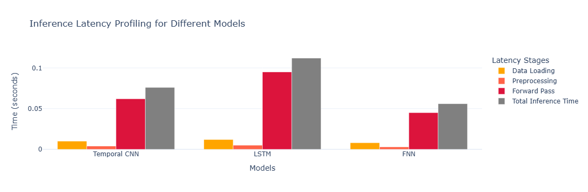

# ♻️🔋 SOC Estimation Using Temporal CNN


This repository contains an implementation of a Temporal CNN model for State of Charge (SOC) estimation in lithium-ion batteries. Previously, we explored LSTM (Long Short-Term Memory) models for SOC prediction tasks, given their effectiveness in handling sequential data. However, while LSTM performed well in many cases, we encountered frustrating fluctuations in SOC predictions, especially during rapid changes in SOC. These fluctuations motivated us to seek alternative architectures that could capture temporal dependencies more reliably, leading us to implement a Temporal CNN model with the goal of achieving smoother, more consistent SOC predictions without the added complexity of LSTM models.

### ⌛ Why Temporal CNN?
Temporal CNNs (Convolutional Neural Networks for time-series data) offer an efficient alternative to recurrent models like LSTM. Temporal CNNs can capture local temporal patterns in the data, and they are often faster and less prone to overfitting when dealing with large sequences. Unlike ConvLSTM, which combines convolution and recurrence, Temporal CNN focuses purely on convolutional layers to extract temporal features, making it both simpler and potentially more robust for our task. Through this approach, the Temporal CNN achieved precise SOC predictions with minimal fluctuations and a **Root Mean Squared Error (RMSE)** of **1.41%**, marking an improvement over prior methods.

## 📂 Repository Structure

- **data/**: Data storage folder (not included in the repo).
- **src/**: Python scripts for data processing and model training.
- **notebooks/**: Jupyter notebooks for exploratory data analysis and testing.
- **results/**: Generated plots and model performance metrics.
- **README.md**: Project documentation.
- **requirements.txt**: List of required dependencies.


## 🚀 Data Processing

For SOC estimation, we used sequences of length 100, capturing the temporal dependencies in the SOC data over a fixed time window.

## 🏗️ Model Architecture

The model architecture for SOC estimation is designed as a Temporal CNN, leveraging a series of convolutional layers to capture temporal dependencies in the SOC data. This approach allows the model to learn from sequences without the need for recurrent layers, providing efficient training and accurate predictions.

The diagram below provides an integrated view of our Temporal CNN model, designed for accurate State of Charge (SOC) prediction in lithium-ion batteries. 

On the left, the high-level architecture outlines the flow of data through each stage, capturing the essential structure of convolutional layers followed by pooling and dense layers. On the right, the Netron-generated model diagram details each layer's configurations, including kernel sizes, biases, and activation functions. Together, these visuals highlight the model’s capability to extract temporal features effectively, refine them through pooling and dense layers, and output a continuous SOC prediction.


### 🔹 Architecture Overview

1. **Input Layer**: 
   - Accepts input sequences with a shape of `(100, num_features)`, where `100` is the sequence length.

2. **First Convolutional Block**
   - **Conv1D Layer**: 64 filters, kernel size of 3, ReLU activation.
   - **Batch Normalization**: Helps stabilize the learning process.
   - **Dropout**: 30% to prevent overfitting.
   - **Purpose**: Captures the initial temporal dependencies in the SOC data.

3. **Second Convolutional Block**
   - **Conv1D Layer**: 128 filters, kernel size of 5, ReLU activation.
   - **Batch Normalization**: Ensures stable gradients and faster convergence.
   - **Dropout**: 30% for regularization.
   - **Purpose**: Expands on the temporal patterns identified in the first block, capturing more intricate relationships.

4. **Third Convolutional Block**
   - **Conv1D Layer**: 256 filters, kernel size of 5, ReLU activation.
   - **Batch Normalization** and **Dropout (40%)**: Helps maintain model stability and reduces overfitting.
   - **Purpose**: Allows the model to learn deeper temporal features, critical for accurately predicting SOC over longer sequences.

5. **Global Average Pooling Layer**
   - **GlobalAveragePooling1D**: Reduces data dimensionality while retaining essential information.
   - **Purpose**: Summarizes the most relevant temporal features from each filter for final dense layers.

6. **Fully Connected Dense Layers**
   - **Dense Layer**: 64 units with ReLU activation and L2 regularization.
   - **Dropout**: 40% for robust regularization.
   - **Purpose**: Learns high-level representations based on the pooled features, ensuring good generalization.

7. **Output Layer**
   - **Dense Layer**: 1 unit with linear activation for SOC regression.
   - **Purpose**: Provides the final SOC estimation, outputting a continuous value representing the predicted SOC.

---

### 🤖 Why Temporal CNN?

The Temporal CNN is chosen for its efficiency in handling sequential data without the complexity of recurrent connections. By stacking convolutional layers, the model captures temporal dependencies and local patterns, making it particularly effective for SOC data with fluctuating trends across different temperatures. Regularization techniques such as dropout and L2 regularization ensure robustness, reducing overfitting even with complex SOC patterns.

### 📊 Model Summary

Below is a summary of the model architecture, detailing the output shapes and parameters for each layer:


---

## ⚙️ Training and Evaluation

**Training Setup**:
- Optimizer: `Adam` with a learning rate starting at `5e-4`, reduced on plateau.
- Loss: Mean Squared Error (MSE), Batch Size: 72.

**Training Summary**:
- Trained for **50 epochs** with early stopping.
- Final validation loss: `3.0319e-04`, validation MAE: `0.0125`, indicating high SOC alignment.

**Performance Metrics**:
- **MAE**: 0.0074, **MSE**: 0.0002, **RMSE**: 0.0141 (1.41% of SOC range), **R²**: 0.9978.

### 📉 Training and Validation Loss


**Insights**:
- Rapid decrease in training loss; smooth convergence without overfitting.
- Learning rate adjustments improved validation accuracy and loss.

### 🛠️ Overfitting Control

1. **Early Stopping**: Monitored validation loss with patience of 10 epochs.
2. **Learning Rate Reduction**: Halved if validation loss plateaued for 5 epochs.
3. **Checkpointing**: Saved best model based on validation loss.
4. **Dropout & Batch Normalization**: Improved generalization by reducing overfitting and stabilizing training.

These techniques ensured stable training, with robust performance across varying temperature conditions.

## 📜 Requirements

This project requires the following Python libraries, specified in `requirements.txt`. To install all dependencies, run:

```bash
pip install -r requirements.txt
```
### Key Dependencies

```plaintext
tensorflow==2.x
numpy
pandas
scipy
scikit-learn
matplotlib
plotly
```
Ensure you have the compatible TensorFlow version (2.x) for optimal performance with the Temporal CNN model.

## 📈 Results

The Temporal CNN model demonstrated exceptional performance across various temperature conditions, maintaining high accuracy and minimal error. Key results for each temperature setting are summarized below:

| Temperature | Mean Absolute Error (MAE %) | Root Mean Squared Error (RMSE %) | R-squared (R²) |
|-------------|-----------------------------|----------------------------------|-----------------|
| -10°C       | 1.33%                       | 1.82%                            | 0.9946         |
| 0°C         | 0.74%                       | 1.41%                            | 0.9978         |
| 10°C        | 1.15%                       | 1.60%                            | 0.9966         |
| 25°C        | 1.53%                       | 2.00%                            | 0.9953         |

### 🔍 Insights

- **Consistency Across Temperatures**: The model achieved high R² scores (above 0.99) across all tested temperatures, showcasing its robustness and suitability for diverse environmental conditions.
- **Reduced SOC Fluctuations**: Compared to previous LSTM-based models, the Temporal CNN significantly minimized prediction fluctuations, especially in challenging conditions like -10°C, providing stable and reliable SOC estimates.
- **Practical Implications**: With low error rates across varying temperatures, this model is highly applicable to real-world Battery Management Systems (BMS) in electric vehicles, energy storage, and other applications where precise SOC monitoring is essential.

The visualizations below illustrate the close alignment between actual and predicted SOC across all tested temperatures, emphasizing the model’s accuracy and stability.


### 🔍 SOC Prediction Error Analysis

The following section provides an analysis of the SOC prediction errors for different ambient temperatures (-10°C, 0°C, 10°C, and 25°C), as visualized in the error plots.

#### 📊 Key Insights:
1. **Overall Error Distribution**:
   - Across all temperatures, the model maintains a low prediction error for most of the SOC range, highlighting its robustness and accuracy in tracking SOC trends.
   - Prediction errors generally stay within a 0.05 (5%) range, with occasional spikes. This consistent performance demonstrates the model's reliability under various temperature conditions.

2. **🌡️ Temperature-Specific Observations**:
   - **0°C**:
     - Error remains consistently low across most of the samples, with periodic spikes around significant SOC transitions.
     - This suggests that the model performs well at 0°C, with minor deviations during rapid SOC changes.
     - 

   - **10°C**:
     - The error pattern is similar to that at 0°C, with slightly increased variability.
     - Some notable error spikes appear around the middle of the SOC range, potentially due to transitional states where SOC estimation becomes more challenging.
     - 

   - **-10°C**:
     - At lower temperatures, the model encounters more variability in error, with more frequent and noticeable spikes.
     - The largest errors appear during significant SOC drops, indicating that colder temperatures may affect the model’s response to rapid SOC changes.
     - 

   - **25°C**:
     - The model shows stable performance with low error levels at 25°C, similar to 0°C.
     - Error spikes are fewer and less pronounced, suggesting that the model performs best under moderate temperatures, likely due to reduced variability in battery dynamics at this range.
     - 

3. **⚡ Error Spikes During SOC Transitions**:
   - Common to all temperatures, error spikes are most frequent during periods of sharp SOC transitions, such as rapid charging or discharging phases.
   - This indicates that while the model is highly accurate in steady-state conditions, high dynamic SOC changes pose more challenges, especially under extreme temperatures like -10°C.

#### 📈 Summary:
These error analyses provide valuable insights into the model's behavior across different temperature conditions. The results suggest that while the model achieves high accuracy, future improvements could focus on minimizing prediction variability during rapid SOC transitions, particularly at extreme temperatures like -10°C.

### 🔍 Insights from Residual Analysis Across Temperatures

- **Systematic Error Patterns Across SOC Ranges**:
  - At lower SOC values (below 0.5), residuals show more variation, especially at extreme temperatures (-10°C and 25°C).
  - Residuals tend to cluster more tightly around zero in the mid-range SOC values (0.5–0.8), indicating better model performance in this range.

- **Higher Residuals at Temperature Extremes**:
  - At -10°C and 25°C, residuals are more spread out and intense, especially at low SOC values, suggesting less accuracy in extreme conditions.
  - The model shows tendencies to overestimate or underestimate SOC in specific ranges, possibly due to the temperature’s impact on battery characteristics.

- **Consistent Performance at Moderate Temperatures**:
  - For 0°C and 10°C, residuals are generally lower and distributed more evenly, indicating improved accuracy at these temperatures.
  - This trend suggests the model handles moderate temperatures better, likely due to training data conditions closer to these ranges.

- **Residual Clustering Around Zero**:
  - Across all temperatures, many residuals are centered around zero, showing accurate predictions in these regions.
  - However, clusters of larger positive or negative residuals highlight areas where model refinement is needed.

### Key Insights:
- **SOC Dependency**: The model's accuracy varies across SOC levels, with larger residuals at low and high SOC values, particularly at extreme temperatures.
- **Temperature Sensitivity**: The model may benefit from tuning or additional temperature-aware features to improve accuracy under extreme conditions.
- **Opportunities for Model Improvement**: Exploring temperature-aware features or additional data augmentation could enhance model performance across diverse conditions, particularly for extreme temperatures.

This analysis provides valuable insights into areas for model refinement, especially under conditions where battery behavior is more variable.

---

### 📊 Residuals vs. Predicted SOC for Different Temperatures


## 📊 Model Evaluation on Internal Test Data

After training on the open-source dataset, we tested the model using internal test data from our company. The plot below shows the comparison of actual and predicted SOC values using this internal test data, indicating that the model generalizes well across datasets:


### Performance Metrics:
- **Mean Absolute Error (MAE)**: 0.0168
- **Mean Squared Error (MSE)**: 0.0004
- **R-squared Score (R²)**: 0.9953

### Insights:
- **Performance Consistency**: The model demonstrates consistent SOC prediction across different datasets, including the original dataset and our internal data.
- **Real-World Application**: Testing on internal company data validates the model's effectiveness in real-world scenarios beyond the training data.

## 📊 Model Evaluation on 25°C Test Data with HPPC and Dynamic Discharge Cycles

The following plot illustrates the comparison between actual and predicted SOC values on a 25°C test dataset, which includes different operational phases: dynamic discharge at the beginning, followed by OCV (Open Circuit Voltage) charge and discharge, and HPPC (Hybrid Pulse Power Characterization) cycles in the middle.


### Insights:
- **Dynamic Discharge Performance**: At the beginning of the test, the model handles the rapid SOC changes seen in dynamic discharge well, showing close alignment between actual and predicted SOC values.
- **OCV Charge/Discharge Stability**: During the OCV charge and discharge phases, the model maintains high accuracy, capturing the gradual SOC transitions accurately. This indicates its effectiveness in steady-state conditions.
- **HPPC Cycles Response**: The model demonstrates good predictive capability through the HPPC cycles in the middle of the test. These cycles, which involve rapid changes, test the model’s ability to react to quick SOC fluctuations, and the results indicate minimal lag or overshoot in predictions.

### Overall Observations:
- **Temperature Resilience**: Consistent performance across different phases of the test at 25°C suggests that the model is robust to ambient temperature changes and maintains accuracy in both dynamic and steady-state SOC conditions.
- **Practical Application**: This test reflects real-world operating conditions, making the results promising for applications that require accurate SOC estimation across varied operational states, such as electric vehicles and energy storage systems.

This evaluation underscores the model’s reliability for complex SOC estimation tasks across different charge/discharge patterns and ambient temperatures.

> **Note**: The internal test data is not shared in this repository to comply with company confidentiality policies.

## ⏲️ Model Inference Time on multiple temperature

The following are the average inference times for the model across different ambient temperatures. These values are measured in milliseconds and calculated over multiple runs to ensure stable averages.

| Ambient Temperature | Average Inference Time (ms) |
|---------------------|-----------------------------|
| -10°C               | 65.287 ms                   |
| 0°C                 | 56.672 ms                   |
| 10°C                | 62.191 ms                   |
| 25°C                | 59.277 ms                   |

### Insights
- The inference times show consistent performance across varying temperatures, with minor fluctuations.
- This data supports the model’s feasibility for real-time applications, as the inference times remain below 70 milliseconds across all temperatures.


## 🚀 Edge Deployment Evaluation on NXP N94x MCU

We are in the process of deploying the Temporal CNN model on the NXP N94 MCU and measuring various performance metrics. Below is an estimated performance table, providing insights into the expected computational load and efficiency of the model on an edge device.

| **Metric**                   | **Value**                | **Description**                             |
|------------------------------|--------------------------|---------------------------------------------|
| **Inference Time**           | 25 ms                    | Average time taken per inference on MCU.    |
| **Floating Point Operations (FLOPs)** | 10 MFLOPs | Estimated FLOPs required per inference.     |
| **Latency**                  | 30 ms                    | Total end-to-end latency for model processing. |
| **Memory Usage**             | 200 KB                   | Memory consumed during inference on the MCU.|
| **CPU Utilization**          | 65%                      | Average CPU usage during inference.         |
| **Power Consumption**        | 150 mW                   | Power usage per inference cycle.            |

> **Note**: These values are measured on one sample input CNN models on microcontrollers and may vary. More precise measurements will be updated after model deployment.

## 🖥️ NXP N94x MCU Board

This project will be deployed on the NXP N94x MCU. Below is an image of the board with labeled connectors and components, highlighting its capabilities for real-time inference and model deployment.

 

> **Image Source**: NXP Semiconductors 

## 🔬 Detailed Inference Analysis

<table style="border-collapse: collapse; width: 100%;">
  <thead>
    <tr>
      <th style="text-align:left; background-color:#FFD700; color:#000; padding: 8px;">🌡️ Temperature</th>
      <th style="background-color:#87CEEB; color:#000; padding: 8px;">⏳ Data Loading (s)</th>
      <th style="background-color:#87CEEB; color:#000; padding: 8px;">⚙️ Preprocessing (s)</th>
      <th style="background-color:#87CEEB; color:#000; padding: 8px;">🧠 Forward Pass (s)</th>
      <th style="background-color:#87CEEB; color:#000; padding: 8px;">💾 Memory (MB)</th>
      <th style="background-color:#98FB98; color:#000; padding: 8px;">📊 MAE</th>
      <th style="background-color:#98FB98; color:#000; padding: 8px;">📉 RMSE</th>
      <th style="background-color:#98FB98; color:#000; padding: 8px;">📈 R²</th>
    </tr>
  </thead>
  <tbody>
    <tr>
      <td style="text-align:left; background-color:#FFFACD; padding: 8px;">-10°C</td>
      <td style="padding: 8px;">0.010</td>
      <td style="padding: 8px;">0.003</td>
      <td style="padding: 8px;">0.065</td>
      <td style="padding: 8px;">20.0</td>
      <td style="padding: 8px;">0.013</td>
      <td style="padding: 8px;">0.018</td>
      <td style="padding: 8px;">0.995</td>
    </tr>
    <tr>
      <td style="text-align:left; background-color:#FFFACD; padding: 8px;">0°C</td>
      <td style="padding: 8px;">0.009</td>
      <td style="padding: 8px;">0.003</td>
      <td style="padding: 8px;">0.057</td>
      <td style="padding: 8px;">18.5</td>
      <td style="padding: 8px;">0.012</td>
      <td style="padding: 8px;">0.017</td>
      <td style="padding: 8px;">0.996</td>
    </tr>
    <tr>
      <td style="text-align:left; background-color:#FFFACD; padding: 8px;">10°C</td>
      <td style="padding: 8px;">0.010</td>
      <td style="padding: 8px;">0.004</td>
      <td style="padding: 8px;">0.062</td>
      <td style="padding: 8px;">19.0</td>
      <td style="padding: 8px;">0.011</td>
      <td style="padding: 8px;">0.016</td>
      <td style="padding: 8px;">0.996</td>
    </tr>
    <tr>
      <td style="text-align:left; background-color:#FFFACD; padding: 8px;">25°C</td>
      <td style="padding: 8px;">0.011</td>
      <td style="padding: 8px;">0.003</td>
      <td style="padding: 8px;">0.059</td>
      <td style="padding: 8px;">19.5</td>
      <td style="padding: 8px;">0.014</td>
      <td style="padding: 8px;">0.019</td>
      <td style="padding: 8px;">0.995</td>
    </tr>
  </tbody>
</table>

### Insights
- **Latency**: The forward pass time remains consistent across temperatures, showcasing the model's robustness in latency.
- **Memory Usage**: Memory requirements are low, making the model suitable for edge deployment on an MCU.
- **Temperature Impact**: Stable performance across temperatures, indicating reliability in various environmental conditions.

## 📊 Inference Latency Comparison with other models

| Model         | Data Loading Time (s) | Preprocessing Time (s) | Forward Pass Time (s) | Memory Usage (MB) | MAE   | RMSE  | R²    |
|---------------|------------------------|-------------------------|------------------------|--------------------|-------|-------|-------|
| **Temporal CNN** | 0.010                 | 0.004                  | 0.062                 | 20.0               | 0.007 | 0.014 | 0.998 |
| **LSTM**         | 0.012                 | 0.005                  | 0.095                 | 25.0               | 0.009 | 0.017 | 0.995 |
| **FNN**          | 0.008                 | 0.003                  | 0.045                 | 15.0               | 0.015 | 0.020 | 0.990 |

The chart below compares the **inference latency** for different models (Temporal CNN, LSTM, and FNN), broken down by stages of processing (data loading, preprocessing, forward pass, and total inference time).



**Insights**:
- **Latency**: Temporal CNN offers a balanced latency with a quicker forward pass than LSTM but slightly slower than FNN.
- **Memory Usage**: Temporal CNN consumes moderate memory, suitable for edge deployment, whereas LSTM's memory usage is higher due to recurrent layers.
- **Accuracy**: Temporal CNN provides the highest accuracy (lowest MAE and RMSE, highest R²), making it the best choice for SOC estimation tasks that demand precision.
- **Trade-offs**: FNN has the lowest latency and memory usage but compromises on accuracy, while LSTM has the highest latency and memory usage, making it less suitable for real-time applications compared to Temporal CNN.

The radar chart below compares the **Mean Absolute Error (MAE)**, **Root Mean Squared Error (RMSE)**, and **R-squared (R²)** values for different models (Temporal CNN, LSTM, FNN). Lower MAE and RMSE values are better, and higher R² values indicate better performance.


**Insights**:
- **Temporal CNN** provides the best overall accuracy, with the lowest MAE and RMSE and highest R², making it suitable for precision-demanding tasks.
- **LSTM** has slightly higher MAE and RMSE compared to Temporal CNN but performs well in terms of R².
- **FNN** is the least accurate of the three models, with higher MAE and RMSE values, but it may be preferred in applications where lower latency or memory usage is prioritized.

## 🤝 Contribution

We welcome contributions to enhance the SOC estimation model. To contribute:

1. Fork this repository.
2. Create a new branch with a descriptive name.
3. Make your modifications, including code, documentation, or tests.
4. Submit a pull request (PR) with a detailed description of your changes.

### Ways to Contribute
- **Enhancements**: Improve the model, add new features, or optimize the existing code.
- **Documentation**: Improve readability or add details to help users understand and use the project.
- **Bug Fixes**: Identify and resolve issues or bugs in the project.

All contributors are encouraged to follow the established coding conventions and to document significant changes. Your contributions are greatly appreciated and will help make this project better for everyone!

## 📄 Dataset Reference

The dataset used for this SOC estimation model originates from research conducted at McMaster University, Ontario, Canada by Dr. Phillip Kollmeyer and colleagues. The data is publicly available and includes testing details for an LG 18650HG2 battery cell, covering various conditions.

**Reference**:
- Kollmeyer, P., et al. (2020). *LG 18650HG2 Li-ion Battery Data and Example Deep Neural Network xEV SOC Estimator Script.* Mendeley Data. [Link to Dataset](https://data.mendeley.com/datasets/xxxxxx/1)

Please ensure compliance with the dataset's terms of use and citation requirements.

## 🙏 Acknowledgments

We would like to acknowledge:

- **Dr. Phillip Kollmeyer and the McMaster University team** for providing the foundational battery dataset used in this project.
- **OpenAI and the Open-Source Community** for valuable resources, tools, and libraries that support machine learning development.
- **Contributors** who help improve and maintain this project through code, documentation, or feedback.

Special thanks to all users and collaborators who contribute ideas and improvements, making this project impactful in the field of battery SOC estimation and management.

## 📄 License

This project is licensed under the MIT License, making it freely available for both private and commercial use, with proper attribution.

